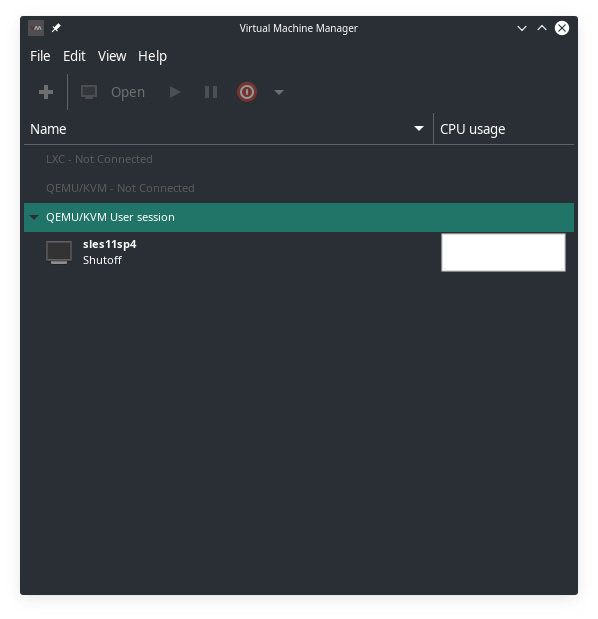

# NetIQ Access Manager Appliance Installation 
### In this folder are the screen-grabs of the Installation Process
## Host OS 
### Manjaro Linux KDE: Juhraya 18.1.1,  
### Kernel: 5.2.21-1-MANJARO
## Guest System 
### Virtual Machine Manager: virt-manager 2.2.1
CPU: 1
RAM: 1024 MB
HDD: 16.0 GB
### QEMU:///session

